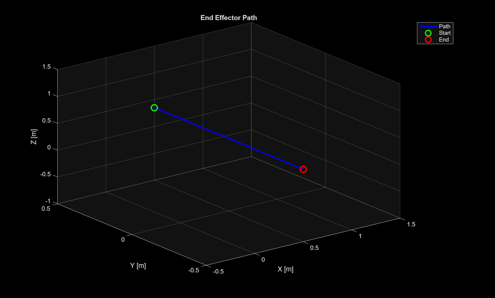
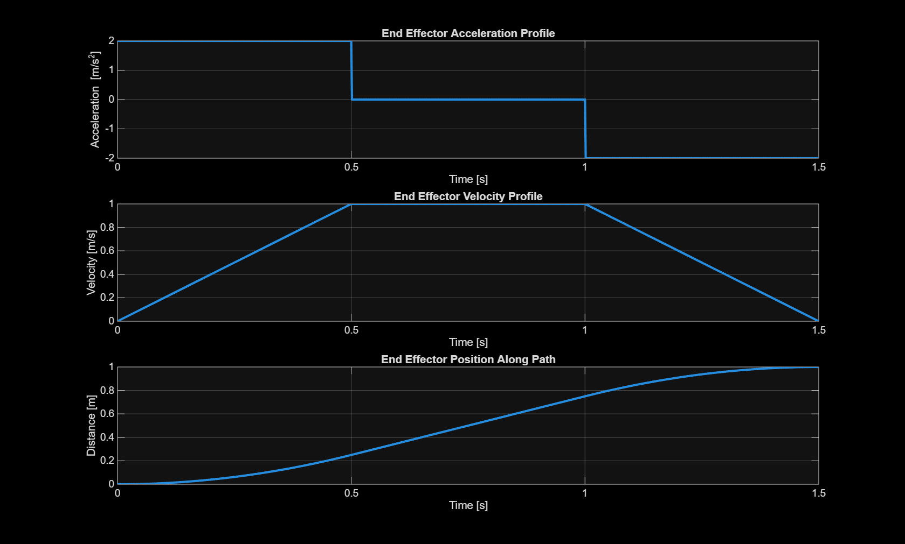
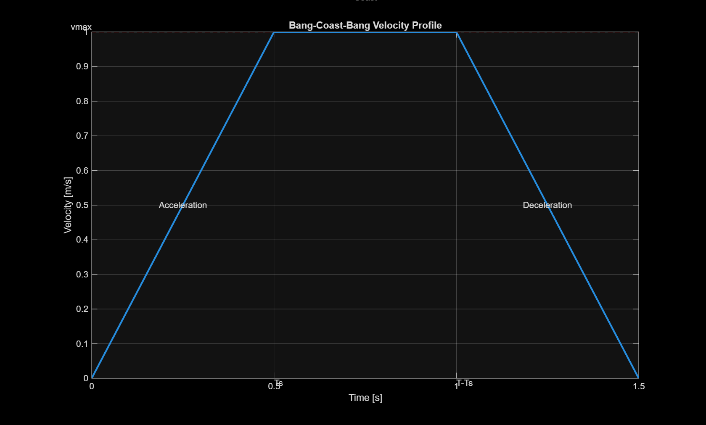
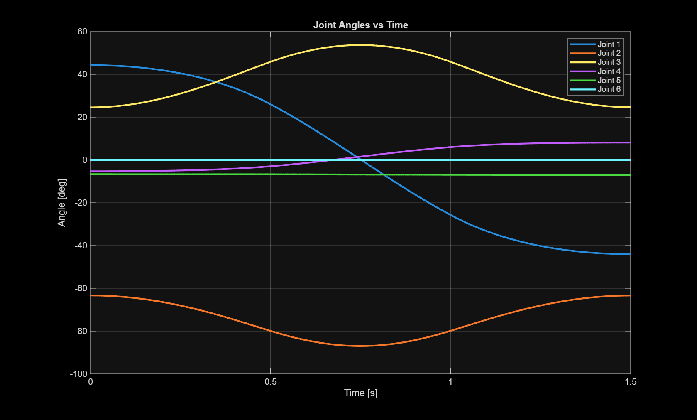
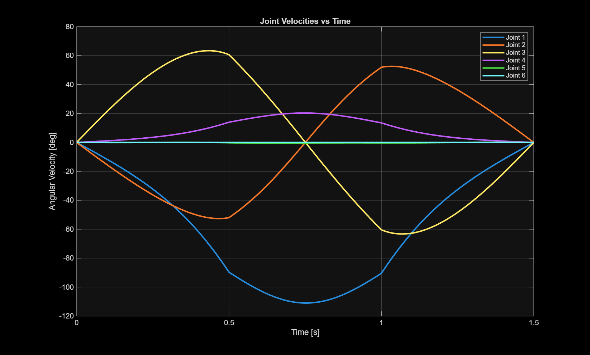
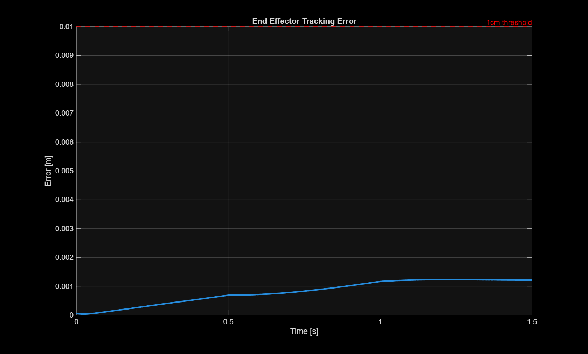
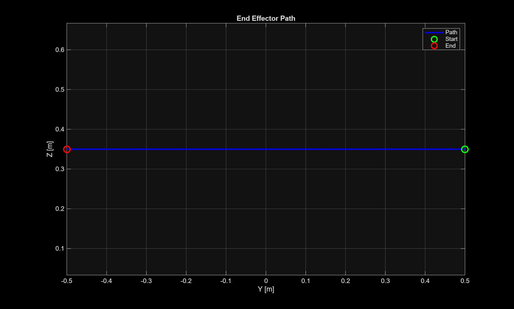

# ABB CRB 15000 Robotic Arm Kinematics & Trajectory Planning

This repository contains the MATLAB simulation of the kinematics and trajectory planning for a 6-DOF ABB CRB 15000 robotic arm. It was originally developed as part of a final year Master's project and is currently being enhanced.

## Project Overview

The project simulates the movement of the robotic arm's end-effector from an initial position to a final position in Cartesian space, utilizing a time-optimal "bang-coast-bang" trajectory. It handles the coordinate transformations between Cartesian space and the robot's joint space using numerical inverse kinematics.

### Key Features
* **Trajectory Generation:** Generates a smooth, time-optimal Cartesian trajectory using a bang-coast-bang (trapezoidal velocity) profile, ensuring the robot adheres to predefined velocity (`vmax`) and acceleration (`amax`) constraints.
* **Kinematics Engine:** 
  * Implements Forward Kinematics based on Denavit-Hartenberg (DH) parameters.
  * Calculates the analytical Jacobian matrix.
* **Inverse Kinematics Solver:**
  * Uses a Gradient Descent solver to find the initial joint configuration.
  * Employs the Jacobian Moore-Penrose pseudo-inverse for continuous trajectory tracking (Inverse Differential Kinematics).
* **Visualization:** Plots detailed graphs of position, velocity, and acceleration profiles, and provides a 3D animation of the robotic arm's end-effector motion.

## Demonstration

Here is a quick look at the simulated trajectory and kinematics of the ABB CRB 15000:

<video src="https://github.com/earlchirchir/abb-crb-15000-kinematics/raw/master/demonstration.mp4" controls="controls" muted="muted" style="max-width: 100%;"></video>

## Generated Plots

Below are the static trajectory and kinematics profiles automatically generated during the simulation:

### 3D End Effector Path

### 3D Trajectory Animation
<video src="https://github.com/earlchirchir/abb-crb-15000-kinematics/raw/master/simulation_animation.mp4" controls="controls" muted="muted" style="max-width: 100%;"></video>

### Trajectory Profiles

### Velocity Details

### Joint Kinematics

### Tracking Error & 2D Projection

## File Structure
* `main.m`: The primary entry point script that orchestrates the simulation, trajectory generation, IK solving, and plotting.
* `DH.m`: Defines the Denavit-Hartenberg parameters for the ABB CRB 15000.
* `dirkin_ABB.m`: Computes the forward (direct) kinematics to find the end-effector position given joint angles.
* `jacobian_ABB.m`: Computes the Jacobian matrix for the current joint configuration.
* `calculate_dirkin_and_jacobian_ABB.m`: A utility script that symbolically derives the forward kinematics and Jacobian matrix and generates the corresponding MATLAB functions.
* `ME7761_K2404618_Report-1.pdf`: The final year project report detailing the theoretical framework and conclusions.

## How to Run
1. Open MATLAB and navigate to this repository's directory.
2. Run the `main.m` script.
3. The script will output its progress to the command window and generate multiple figures displaying the trajectory profiles, joint angles, tracking error, and a 3D animation of the path.

## Future Enhancements
This project is actively being refactored and improved. Planned enhancements include:
* Implementing Damped Least Squares (DLS) for robust singularity handling.
* Adding Closed-Loop Inverse Kinematics (CLIK) to eliminate integration drift.
* Upgrading to full 6-DOF tracking (Position + Orientation).
* Utilizing the Jacobian null-space for secondary objectives like joint limit avoidance.
